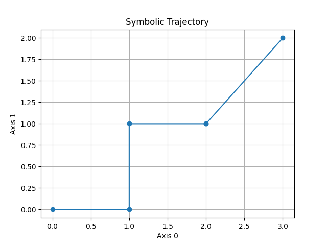

# Symbolic Dynamics Engine

Experimental framework for studying **symbolic sequences as dynamical systems**.

Instead of treating symbols as static tokens, this project interprets them as **operators that transform a state space**.

A symbolic sequence becomes a **trajectory through a geometric structure**.

---

## Core Concept

symbol → operator
operator → state transformation
sequence → trajectory
trajectory → measurable structure

Meaning emerges from the **geometry of the trajectory**, not from the symbol itself.

---

## Demo

Example symbolic sequence:

```
cave horse cave storm ladder
```

Produces a trajectory through the cube state space.



## State Space

The current implementation uses an **n-dimensional hypercube**.

Each vertex represents a system state.

Each edge represents a **bit-flip transformation**.

Example state sequence:

```
000
100
110
010
011
```

Each step corresponds to moving along one axis of the cube.

---

## Example Symbolic Grammar

```
cave   → flip bit 0
horse  → flip bit 1
storm  → flip bit 2
ladder → flip bits (0,1)
```

Sequence:

```
cave horse cave storm ladder
```

Produces a trajectory through the cube state space.

---

## Project Structure

```
symbolic_dynamics
    state_spaces
    grammars
    walkers
    observers
    visualization
    analysis
```

Modules include:

• hypercube / k-cube state spaces
• symbolic grammar engines
• trajectory walkers
• entropy and attractor analysis
• clustering and embeddings

---

## Example

Run a symbolic trajectory experiment:

```bash
python experiments/symbolic_sequence_demo.py
```

---

## Research Direction

The framework explores connections between:

• symbolic dynamics
• graph dynamical systems
• sequence embeddings
• symbolic AI

Symbolic languages can be analyzed as **trajectories in structured state spaces**.

---

## Entropy convergence (Golden Mean Shift)

The entropy can be approximated using:

h ≈ log(|L_n|) / n


## Status

Early experimental research project.

Contributions and experiments are welcome.

